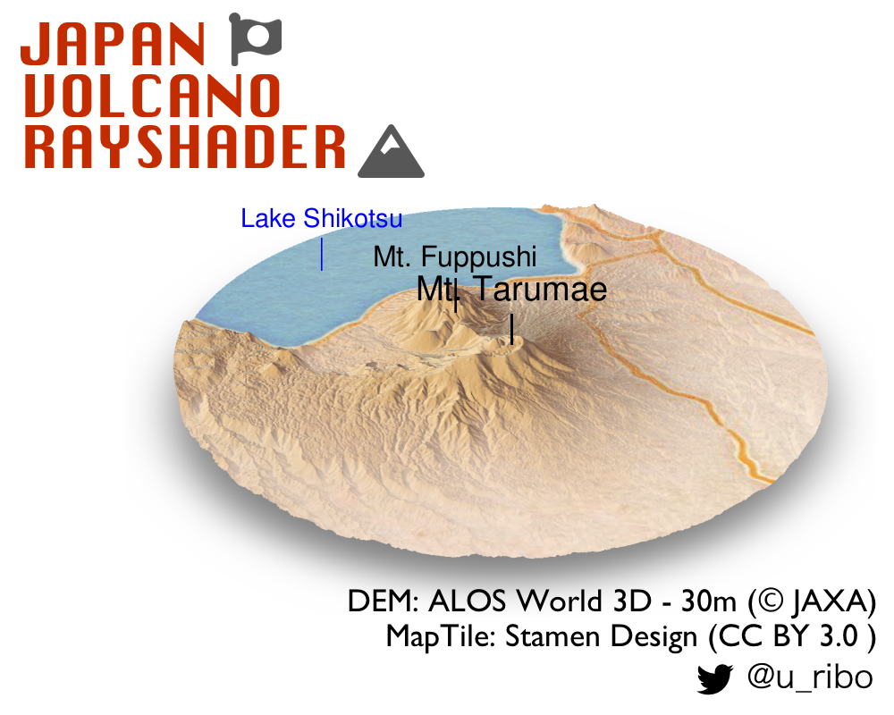

日本の火山
========

国土地理院 [火山基本図のページ](https://www.gsi.go.jp/bousaichiri/volcano-maps-vbm.html)に記録されている日本国内の火山のうち、
西之島を除いた39の火山について立体的な可視化を行いました。

火山の座標から半径10km範囲に含まれるDEM領域を切り出し、rayshaderによる陰影起伏図を作成、背景にStamen Designのタイル画像を重ねています。

<p align="center"></p>

## Source

- 火山の一覧... 国土地理院 火山基本図／火山基本図データ https://www.gsi.go.jp/bousaichiri/volcano-maps-vbm.html
- DEM... ALOS全球数値地表モデル (&#169;JAXA) http://www.eorc.jaxa.jp/ALOS/aw3d30/index_j.htm
- 背景タイル... Stamen Design (CC BY 3.0)

<p align="center"></p>

## Session Info

``` r
sessioninfo::session_info()
─ Session info ─────────────────────────────────────────────────────────────────────────────────────────────────────────────────────────────────────────────────────────────────────────────────────────────────
 setting  value                       
 version  R version 3.6.0 (2019-04-26)
 os       macOS Mojave 10.14.6        
 system   x86_64, darwin18.5.0        
 ui       RStudio                     
 language En                          
 collate  ja_JP.UTF-8                 
 ctype    ja_JP.UTF-8                 
 tz       Asia/Tokyo                  
 date     2019-08-24                  

─ Packages ─────────────────────────────────────────────────────────────────────────────────────────────────────────────────────────────────────────────────────────────────────────────────────────────────────
 ! package          * version    date       lib source                          
 P abind            * 1.4-5      2016-07-21 [?] CRAN (R 3.6.0)                  
 P assertr            2.6        2019-01-22 [?] CRAN (R 3.6.0)                  
 P assertthat         0.2.1      2019-03-21 [?] standard (@0.2.1)               
 P backports          1.1.4      2019-04-10 [?] standard (@1.1.4)               
 P bmp                0.3        2017-09-11 [?] CRAN (R 3.6.0)                  
 P class              7.3-15     2019-01-01 [?] standard (@7.3-15)              
 P classInt           0.4-1      2019-08-06 [?] standard (@0.4-1)               
 P cli                1.1.0      2019-03-19 [?] standard (@1.1.0)               
 P codetools          0.2-16     2018-12-24 [?] standard (@0.2-16)              
 P colorspace         1.4-1      2019-03-18 [?] standard (@1.4-1)               
 P conflicted       * 1.0.4      2019-06-21 [?] CRAN (R 3.6.0)                  
 P crayon             1.3.4      2017-09-16 [?] standard (@1.3.4)               
 P crosstalk          1.0.0      2016-12-21 [?] CRAN (R 3.6.0)                  
 P DBI                1.0.0      2018-05-02 [?] standard (@1.0.0)               
 P digest             0.6.20     2019-07-04 [?] standard (@0.6.20)              
 P doParallel         1.0.15     2019-08-02 [?] CRAN (R 3.6.0)                  
 P dplyr            * 0.8.3      2019-07-04 [?] standard (@0.8.3)               
 P e1071              1.7-2      2019-06-05 [?] standard (@1.7-2)               
 P forcats            0.4.0      2019-02-17 [?] standard (@0.4.0)               
 P foreach            1.4.7      2019-07-27 [?] standard (@1.4.7)               
 P fs                 1.3.1      2019-05-06 [?] standard (@1.3.1)               
 P geoviz           * 0.2.1      2019-05-03 [?] CRAN (R 3.6.0)                  
 P ggplot2            3.2.1      2019-08-10 [?] standard (@3.2.1)               
 P glue               1.3.1.9000 2019-08-09 [?] Github (tidyverse/glue@7ac044a) 
 P gtable             0.3.0      2019-03-25 [?] standard (@0.3.0)               
 P here               0.1        2017-05-28 [?] standard (@0.1)                 
 P hms                0.5.1      2019-08-23 [?] CRAN (R 3.6.0)                  
 P htmltools          0.3.6      2017-04-28 [?] standard (@0.3.6)               
 P htmlwidgets        1.3        2018-09-30 [?] CRAN (R 3.6.0)                  
 P httpuv             1.5.1      2019-04-05 [?] CRAN (R 3.6.0)                  
 P httr               1.4.1      2019-08-05 [?] CRAN (R 3.6.0)                  
 P igraph             1.2.4.1    2019-04-22 [?] CRAN (R 3.6.0)                  
 P imager             0.41.2     2019-01-23 [?] CRAN (R 3.6.0)                  
 P iterators          1.0.12     2019-07-26 [?] standard (@1.0.12)              
 P jpeg               0.1-8      2014-01-23 [?] standard (@0.1-8)               
 P jpmesh             1.1.3.9000 2019-08-16 [?] Github (uribo/jpmesh@bd0b878)   
 P jsonlite           1.6        2018-12-07 [?] standard (@1.6)                 
 P KernSmooth         2.23-15    2015-06-29 [?] standard (@2.23-15)             
 P knitr            * 1.24       2019-08-08 [?] standard (@1.24)                
 P later              0.8.0      2019-02-11 [?] CRAN (R 3.6.0)                  
 P lattice            0.20-38    2018-11-04 [?] standard (@0.20-38)             
 P lazyeval           0.2.2      2019-03-15 [?] standard (@0.2.2)               
 P leaflet            2.0.2      2018-08-27 [?] CRAN (R 3.6.0)                  
 P magrittr         * 1.5        2014-11-22 [?] standard (@1.5)                 
 P manipulateWidget   0.10.0     2018-06-11 [?] CRAN (R 3.6.0)                  
 P memoise            1.1.0      2017-04-21 [?] CRAN (R 3.6.0)                  
 P mime               0.7        2019-06-11 [?] standard (@0.7)                 
 P miniUI             0.1.1.1    2018-05-18 [?] CRAN (R 3.6.0)                  
 P munsell            0.5.0      2018-06-12 [?] standard (@0.5.0)               
 P pillar             1.4.2      2019-06-29 [?] standard (@1.4.2)               
 P pkgconfig          2.0.2      2018-08-16 [?] standard (@2.0.2)               
 P plyr               1.8.4      2016-06-08 [?] standard (@1.8.4)               
 P png                0.1-7      2013-12-03 [?] CRAN (R 3.6.0)                  
 P prettyunits        1.0.2      2015-07-13 [?] standard (@1.0.2)               
 P progress           1.2.2      2019-05-16 [?] standard (@1.2.2)               
 P promises           1.0.1      2018-04-13 [?] CRAN (R 3.6.0)                  
 P purrr              0.3.2      2019-03-15 [?] standard (@0.3.2)               
 P R6                 2.4.0      2019-02-14 [?] standard (@2.4.0)               
 P raster           * 3.0-2      2019-08-22 [?] CRAN (R 3.6.0)                  
 P rayshader        * 0.11.5     2019-07-11 [?] CRAN (R 3.6.0)                  
 P Rcpp               1.0.2      2019-07-25 [?] standard (@1.0.2)               
 P readbitmap         0.1.5      2018-06-27 [?] CRAN (R 3.6.0)                  
 P readr              1.3.1      2018-12-21 [?] standard (@1.3.1)               
 R renv               0.6.0-35   <NA>       [?] <NA>                            
 P rgl                0.100.30   2019-08-19 [?] CRAN (R 3.6.0)                  
 P rlang              0.4.0.9002 2019-08-09 [?] Github (r-lib/rlang@09fbc86)    
 P rprojroot          1.3-2      2018-01-03 [?] standard (@1.3-2)               
 P rvest            * 0.3.4      2019-05-15 [?] standard (@0.3.4)               
 P scales             1.0.0      2018-08-09 [?] standard (@1.0.0)               
 P sessioninfo        1.1.1      2018-11-05 [?] CRAN (R 3.6.0)                  
 P sf               * 0.7-7      2019-07-24 [?] standard (@0.7-7)               
 P shiny              1.3.2      2019-04-22 [?] CRAN (R 3.6.0)                  
 P sp               * 1.3-1      2018-06-05 [?] CRAN (R 3.6.0)                  
 P stars            * 0.3-1      2019-04-23 [?] CRAN (R 3.6.0)                  
 P stringi            1.4.3      2019-03-12 [?] standard (@1.4.3)               
 P stringr            1.4.0      2019-02-10 [?] standard (@1.4.0)               
 P tibble             2.1.3      2019-06-06 [?] standard (@2.1.3)               
 P tidyr              0.8.3.9000 2019-08-13 [?] github (tidyverse/tidyr@51c4ae7)
 P tidyselect         0.2.5      2018-10-11 [?] standard (@0.2.5)               
 P tiff               0.1-5      2013-09-04 [?] CRAN (R 3.6.0)                  
 P units              0.6-4      2019-08-22 [?] CRAN (R 3.6.0)                  
 P vctrs              0.2.0      2019-07-05 [?] standard (@0.2.0)               
 P webshot            0.5.1      2018-09-28 [?] standard (@0.5.1)               
 P withr              2.1.2      2018-03-15 [?] standard (@2.1.2)               
 P xfun               0.9        2019-08-21 [?] CRAN (R 3.6.0)                  
 P xml2             * 1.2.2      2019-08-09 [?] standard (@1.2.2)               
 P xtable             1.8-4      2019-04-21 [?] CRAN (R 3.6.0)                  
 P zeallot            0.1.0      2018-01-28 [?] standard (@0.1.0)               

[1] /Users/uri/Library/Mobile Documents/com~apple~CloudDocs/projects2019/volcano/renv/library/R-3.6/x86_64-apple-darwin18.5.0
[2] /private/var/folders/12/s9y70flx4z3b67cp237s70xm0000gn/T/Rtmp3cR62Y/renv-system-library

 P ── Loaded and on-disk path mismatch.
 R ── Package was removed from disk.
 ```
